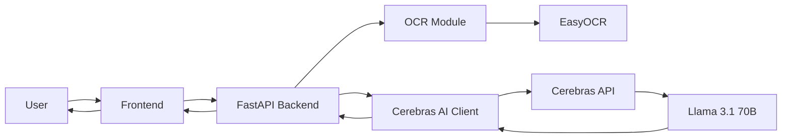

# InvoiceAI

AI-powered invoice data extraction using **Cerebras AI (Llama 3.1 70B)** and **EasyOCR**. Upload an invoice image or PDF, and let the AI extract all the important information with complete accuracy.

## 🌟 Features

- **AI-Powered Extraction**: Uses Cerebras Llama 3.1 70B for intelligent invoice analysis and ALL calculations
- **OCR Support**: Extract text from PDF, JPG, and PNG files using EasyOCR
- **Complete Automation**: AI performs all math (subtotals, taxes, totals, line items)
- **Beautiful UI**: Modern, responsive interface with drag-and-drop file upload
- **Structured Output**: Get clean JSON data plus a formatted invoice summary
- **Multi-Currency Support**: Handles various currencies and tax formats (GST, VAT, Sales Tax)

## 🏗️ Project Structure

```
invai/
├── backend/
│   ├── main.py           # FastAPI application
│   ├── config.py         # Configuration management
│   ├── models.py         # Data models
│   ├── ocr.py            # OCR processing
│   ├── ai_client.py      # Cerebras API client
│   └── requirements.txt  # Python dependencies
├── frontend/
│   ├── index.html        # Main UI
│   ├── styles.css        # Styling
│   └── app.js            # Frontend logic
├── .env                  # Environment variables (create this)
├── .env.example          # Environment template
└── README.md             # This file
```

## 🚀 Prerequisites

- **Python 3.8+**
- **Cerebras API Key** - [Get one here](https://cloud.cerebras.ai/)
- **Poppler** (for PDF processing):
  - **Windows**: Download from [poppler-windows](https://github.com/oschwartz10612/poppler-windows/releases/) and add to PATH
  - **Linux**: `sudo apt-get install poppler-utils`
  - **macOS**: `brew install poppler`

## 📦 Installation

### 1. Clone or Download the Project

```bash
cd c:\Users\HP\OneDrive\Attachments\Desktop\invai
```

### 2. Create Virtual Environment

```bash
# Create virtual environment
python -m venv venv

# Activate virtual environment
# On Windows:
venv\Scripts\activate
# On Linux/Mac:
source venv/bin/activate
```

### 3. Install Dependencies

```bash
cd backend
pip install -r requirements.txt
```

> **Note**: First installation may take a few minutes as EasyOCR downloads language models.

### 4. Configure Environment

Create a `.env` file in the project root:

```bash
# Copy the example file
cp .env.example .env
```

Edit `.env` and add your Cerebras API key:

```
CEREBRAS_API_KEY=your_actual_api_key_here
```

## ▶️ Running the Application

### Start the Backend Server

```bash
# Make sure you're in the backend directory and venv is activated
cd backend
python main.py
```

Or use uvicorn directly:

```bash
uvicorn main:app --reload --host 0.0.0.0 --port 8000
```

The API will be available at `http://localhost:8000`

### Open the Frontend

The backend automatically serves the frontend. Simply open your browser and go to:

```
http://localhost:8000
```

Alternatively, you can serve the frontend separately using any static file server:

```bash
# Using Python's built-in server
cd frontend
python -m http.server 3000
```

Then open `http://localhost:3000`

## 🧪 Testing the API

### Using cURL

```bash
curl -X POST "http://localhost:8000/api/invoice/extract" \
  -H "accept: application/json" \
  -H "Content-Type: multipart/form-data" \
  -F "file=@/path/to/your/invoice.pdf"
```

### Using the UI

1. Open the web interface
2. Drag and drop an invoice file (or click to browse)
3. Click "Extract Invoice"
4. View the formatted summary and raw JSON output

## 📋 API Documentation

### POST `/api/invoice/extract`

Extract invoice data from an uploaded file.

**Request:**
- Method: `POST`
- Content-Type: `multipart/form-data`
- Body: `file` (PDF, JPG, or PNG)

**Response:**
```json
{
  "success": true,
  "data": {
    "supplier_name": "ABC Company",
    "supplier_abn_or_vat": "12345678901",
    "invoice_number": "INV-001",
    "issue_date": "2024-01-15",
    "due_date": "2024-02-15",
    "currency": "USD",
    "subtotal": 1000.00,
    "tax_amount": 100.00,
    "tax_rate": 10.0,
    "total_amount": 1100.00,
    "line_items": [
      {
        "description": "Product A",
        "quantity": 2,
        "unit_price": 500.00,
        "line_total": 1000.00
      }
    ],
    "notes": "Payment terms: Net 30"
  },
  "error": null
}
```

### GET `/api/health`

Check API health and configuration status.

## 🎯 How It Works

1. **Upload**: User uploads an invoice (PDF or image)
2. **OCR**: EasyOCR extracts text from the document
3. **AI Analysis**: Text is sent to Cerebras Llama 3.1 70B with a specialized prompt
4. **Intelligence**: The AI:
   - Identifies all invoice fields
   - Performs ALL calculations (subtotals, taxes, totals)
   - Validates mathematical consistency
   - Returns structured JSON
5. **Display**: Frontend shows both formatted summary and raw JSON

> **Important**: The backend does NO business logic or calculations—everything is done by the AI!

## 🛠️ Architecture



## 🔧 Troubleshooting

### "CEREBRAS_API_KEY not found"
Make sure you've created a `.env` file in the project root with your API key.

### "Failed to extract text from PDF"
Install Poppler for your OS (see Prerequisites section).

### "Module not found" errors
Make sure your virtual environment is activated and all dependencies are installed:
```bash
pip install -r backend/requirements.txt
```

### CORS errors in browser
The backend is configured to allow requests from `localhost:8000`, `localhost:3000`, and `localhost:5500`. If using a different port, update `CORS_ORIGINS` in `backend/config.py`.

### OCR is slow or not working
EasyOCR downloads language models on first run. Subsequent runs will be faster. Ensure you have a stable internet connection for the first run.

## 🎨 Technology Stack

**Backend:**
- FastAPI - Modern Python web framework
- EasyOCR - OCR text extraction
- pdf2image - PDF to image conversion
- Cerebras AI - Llama 3.1 70B for intelligence
- Pydantic - Data validation

**Frontend:**
- HTML5 - Semantic structure
- CSS3 - Modern styling with animations
- Vanilla JavaScript - No frameworks
- Inter Font - Typography

## 📝 Future Enhancements

- [ ] Multi-page invoice support
- [ ] Batch processing multiple invoices
- [ ] Export to Excel/CSV
- [ ] Invoice data validation rules
- [ ] Database storage for invoice history
- [ ] User authentication
- [ ] Additional language support

## 📄 License

This project is provided as-is for educational and commercial use.

## 🙏 Acknowledgments

- Powered by [Cerebras AI](https://cerebras.ai/)
- OCR by [EasyOCR](https://github.com/JaidedAI/EasyOCR)
- Built with [FastAPI](https://fastapi.tiangolo.com/)

---

**Made by Batman**
